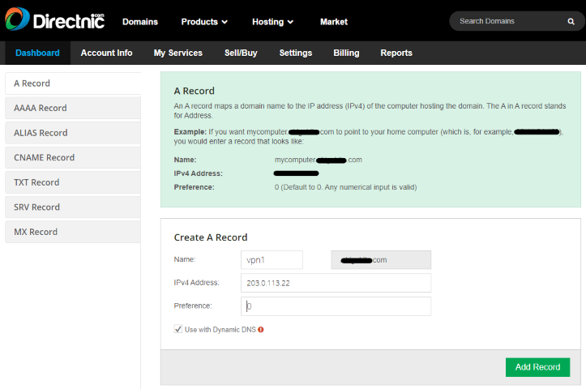
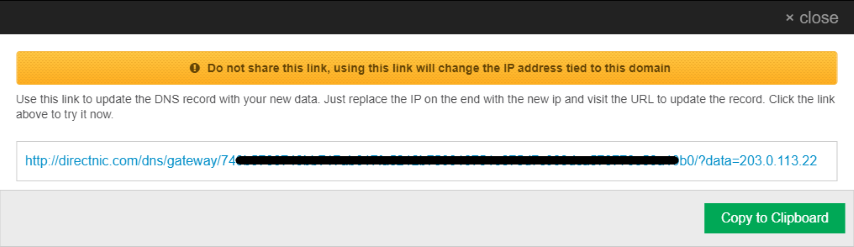
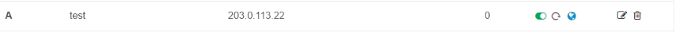

# RefreshIP

`refreship.py` is a simple Python script that retrieves the external IP address of your Internet connection and updates the "A record" defined in your Directnic DNS settings.

Directnic recently started supporting "A Records" for dynamic IP addresses. This means it is now possible to use your own custom domain name for a dynamically assigned Internet IP address rather than using a dynamic DNS provider (e.g., DuckDNS, DynDNS, etc.), which usually only allow custom domain names on a paid plan.

**Why do I need this?**  
  You might want this if you are planning to provide internet services (for example:  Web Server, sFTP Server, VPN Service, etc.) on your home, or office internet and don’t have a static IP address from your Internet service provider.
  
## **Prerequisites**

* A Directnic account with your own custom domain name.
* A DNS A record with the dynamic IP address option set.
* At a minimum Python 3.6 for f-string support.

**Please note:**
  
* Although the Python script is created to work with a Directnic account, it should be easy enough to change and adopt to work with other DNS providers as well.

## **Configuration variables**

* **`url`** - Retrieves the external IP from [myexternalip.com](https://myexternalip.com/raw) (there should be no need to change this).
* **`max_request`** - Maximum number of requests (Default value: 3).
* **`wait_time`** - Wait time between requests in seconds (Default value: 5).
* **`dnic_base_url`** - URL from Directnic account **`without the IP address`**. Replace “**RANDOMNUMBERSANDLETTERS**” with your unique identifier.

  For example:
  * **`"https://directnic.com/dns/gateway/RANDOMNUMBERSANDLETTERS/?data>="`** to **`"https://directnic.com/dns/gateway/9bac109f-94d6-434c-974c-d68c6d4cfa1e/?data>="`**

## **Usage Examples**

### **Command-Line**  
`$./refreship.py`

**Output**  
`Thu Jan 21 07:15:02 2021 - Request successful! - Your external IP: 203.0.113.7`  
`Thu Jan 21 07:15:03 2021 - Request successful! - Your DNS record was updated to 203.0.113.7`  
`Thu Jan 21 07:30:02 2021 - Request successful! - Your external IP: 203.0.113.22`  
`Thu Jan 21 07:30:04 2021 - Request successful! - Your DNS record was updated to 203.0.113.22`  

### **Scheduled run (recommended option)**  
Run every 15 minutes via a CRON job and log status and error messages separately to **/var/log/refreship.log** and **/var/log/refreship_error.log**.

`*/15 * * * * /usr/local/bin/refreship.py >>/var/log/refreship.log 2>>/var/log/refreship_error.log`

## **Directnic DNS Settings**

**Directnic - Add a Dynamic A Record**  

**Directnic - URL to update IP address**  

**Directnic - DNS Entry**  

### **References**

* [Directnic](https://directnic.com)
* [My External IP](https://myexternalip.com/)
* [Online UUID Generator](https://www.uuidgenerator.net/)
* [RFC 5737](https://tools.ietf.org/html/rfc5737)
